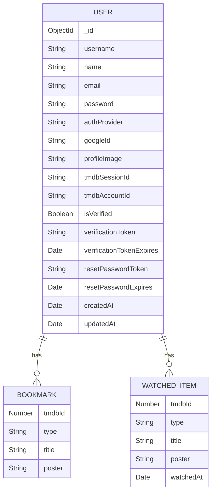
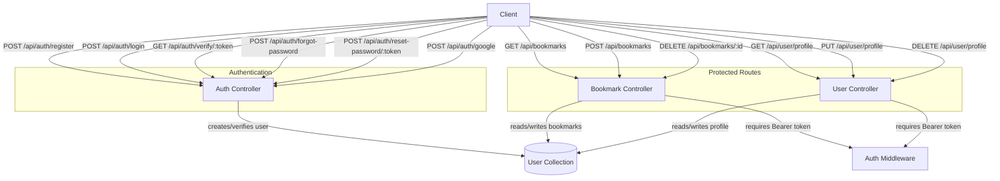

# Database Design

This backend uses MongoDB with a single main collection: `User`.

## Entity Relationship Diagram

## Notes

- `bookmarks` and `watchedList` are stored as embedded arrays inside the `User` document.
- This is a document-based design optimized for fast access to a single user's data.
- The schema is defined in `server/models/User.js`.

## API Flow Diagram

### API Flow Notes

- `AuthController` handles user signup, login, email verification, password reset, and Google OAuth.
- `BookmarkController` uses `AuthMiddleware` to protect bookmark CRUD operations.
- `UserController` uses `AuthMiddleware` to protect profile read/update/delete operations.
- All protected routes read/write the same `User` document.

